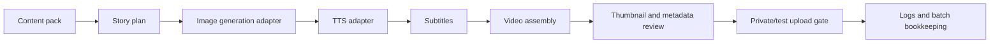

# Reverie Studio

Reverie Studio is a local, Windows-first AI video production studio for
repeatable creator workflows. It is not a hosted SaaS, not a bundled model
pack, and not a finished commercial installer. This repository is an
open-source snapshot of the code, pack structure, validators, tests, and public
docs behind a local AI video production workbench.

The core idea is simple: AI video demos are easy to run once and hard to repeat.
Reverie Studio focuses on the repeatable part: content packs, story planning,
image and TTS adapters, subtitles, video assembly, thumbnail review, metadata
checks, upload safety gates, logs, and batch bookkeeping.

The code is free to use, modify, redistribute, and use commercially under the
MIT License. The repository does not include private credentials, private local
data, generated channel output, voice datasets, BGM libraries, LoRA/model
weights, service-account files, or any rights to third-party assets you add
locally.

## Five-Minute Public Demo

You can verify the public workflow shape without installing AI models or adding
credentials:

```powershell
git clone https://github.com/zoziaman/reverie-studio.git
cd reverie-studio
$env:PYTHONPATH="src"
python -m reverie_doctor --json
python -m reverie_demo --out "$env:TEMP\reverie-public-demo"
Get-Content "$env:TEMP\reverie-public-demo\pipeline_report.md"
```

The demo writes only safe report files outside the repository:

```text
%TEMP%\reverie-public-demo\
  backend_profile.json
  environment_report.json
  quality_gate.json
  video_toon_actor_template.render_plan.json
  video_toon_actor_template.remotion_props.json
  run_manifest.json
  stage_log.jsonl
  pipeline_report.md
```

It proves that a fresh public clone can load a public content pack, map the
workflow stages, record duration/cost/status rows, choose a backend profile,
run a local setup doctor, write a fixed-actor video-toon Remotion props dry-run,
score a public quality gate, and stop before upload. It does not render real
video, call AI APIs, start local model servers, or create generated media. See
`docs/PUBLIC_DEMO.md`.

## Target Workflow



The intended local production loop is:

1. Choose or create a content pack.
2. Generate or draft a story plan.
3. Produce visuals through a local image backend.
4. Produce narration through a configured TTS backend.
5. Assemble subtitles and video.
6. Review thumbnail, title, metadata, safety disclosures, and policy gates.
7. Upload only after explicit user-controlled approval, preferably private/test
   mode first.
8. Keep enough logs to understand cost, duration, failures, and retry points.

## Video-Toon Direction

For video-toon packs, Reverie Studio now treats character consistency as a
pack contract instead of a per-scene prompt trick. A pack should define a fixed
actor pool first, then cast those actors into different episode roles for
omnibus stories. Scene plans should reference `actor_id` instead of asking the
image backend to invent a new lead character each time.

See `docs/VIDEO_TOON_ACTOR_POOL_CONTRACT.md` for the active rule and
`schemas/` for the actor-pool and episode-cast shapes.

## Current Public Snapshot Boundary

This repository is prepared as a sanitized public snapshot. The public branch is
meant to show code structure, workflow contracts, examples, tests, and setup
boundaries without leaking private runtime state.

Included:

- Python desktop app and workflow modules under `src/`
- Public pack templates and prompt examples under `assets/packs/`
- A no-credential dry-run demo under `src/reverie_demo.py`
- A local setup doctor under `src/reverie_doctor.py`
- Public backend profiles under `src/reverie_backends.py`
- A public dry-run quality gate under `src/reverie_quality.py`
- A public demo pack under `examples/public_demo_pack.json`
- Tests for the demo and selected pipeline/security surfaces
- Security and public-release checklists

Not included:

- Real `.env` files, API keys, OAuth tokens, Firebase service-account files, or
  token pickle files
- Generated channel videos, images, thumbnails, audio, subtitles, scripts,
  runtime logs, and caches
- SoVITS/GPT-SoVITS voice datasets, trained voice models, BGM/SFX libraries,
  Stable Diffusion checkpoints, LoRA files, ComfyUI models, and other large
  third-party model/vendor assets
- Private local paths, personal identifiers, memory/session databases, or local
  agent state

## Commercial Readiness Gate

The MIT license permits commercial use of the repository code and docs. That is
not the same as saying this snapshot is a finished commercial product.

Before commercial operation, users still need to provide and verify their own:

- model, voice, BGM, SFX, and asset licenses
- API and platform credentials
- local Windows runtime setup
- content-policy review and synthetic-media disclosure
- private/test upload flow
- failure handling, cost tracking, and retry strategy for their own channel

## Safety Posture

Upload automation is treated as an adapter behind user-controlled
configuration. The safe default is local testing and review. If users enable
YouTube upload flows, they should use private/test uploads first and keep OAuth
files local.

Synthetic or dramatized story content should not be presented as verified real
events. Metadata and titles should preserve disclosure, privacy checks,
scam-prevention disclaimers where relevant, and personal-data blocking.

## Setup Overview

The repository expects users to provide their own local tools, credentials, and
assets. A typical setup looks like this:

1. Install Python 3.11+.
2. Install project dependencies from `pyproject.toml` or `requirements.txt`.
3. Run the public doctor and dry-run before adding real credentials:

```powershell
$env:PYTHONPATH="src"
python -m reverie_doctor --json
python -m reverie_demo --backend-profile local_dry_run --out "$env:TEMP\reverie-public-demo"
```

4. Install and run any local generation services you want to use, such as
   Stable Diffusion WebUI, ComfyUI, GPT-SoVITS, Supertonic 3, or a compatible
   TTS service.
5. Copy `.env.example` to `.env` and fill in local-only values.
6. Run the desktop app:

```powershell
copy .env.example .env
python src\main_gui.py
```

If you ask another Codex session to set this up from GitHub, use the longer
copy-paste prompt in `docs/CODEX_SETUP_PROMPT.md`.

Short version:

```text
Clone this repository, read README.md, .env.example, EXTERNAL_ASSETS.md,
docs/PUBLIC_DEMO.md, docs/BACKEND_PROFILES.md, docs/CODEX_SETUP_PROMPT.md,
SECURITY_PUBLIC_CHECK.md, and PUBLIC_RELEASE_CHECKLIST.md. First run
python scripts/public_snapshot_check.py, python -m reverie_doctor --json, and
the no-credential dry-run demo. Then set up a local Windows development run
without adding real credentials, local paths, model files, voice data, or
generated outputs to git.
```

## Backend Profiles

The public snapshot includes declarative backend profiles so a user or coding
agent can choose a setup path explicitly:

```powershell
$env:PYTHONPATH="src"
python -m reverie_demo --backend-profile local_dry_run --out "$env:TEMP\reverie-public-demo"
python -m reverie_demo --backend-profile local_comfyui_supertonic --out "$env:TEMP\reverie-supertonic-plan"
```

Available profiles:

- `local_dry_run`: no AI services, no credentials, report-only demo
- `local_comfyui_sovits`: ComfyUI plus GPT-SoVITS, using user-provided local assets
- `local_comfyui_supertonic`: ComfyUI plus Supertonic 3 voice presets
- `cloud_assisted_private_review`: explicit opt-in credentials, private/test review first

See `docs/BACKEND_PROFILES.md`.

## Required Local Assets

Reverie Studio can reference external tools and assets, but those are not
bundled here. Users should prepare their own:

- API keys for any LLM/image/video service they choose to use
- YouTube OAuth credentials if they want upload-related flows
- Firebase credentials only if they use license/admin features that require it
- Local TTS or voice-cloning assets, including SoVITS/GPT-SoVITS voice data.
  Supertonic 3 can be enabled with `TTS_ENGINE=supertonic` after installing the
  optional `supertonic` package; see `docs/SUPERTONIC_TTS.md`.
- BGM and SFX assets with licenses suitable for their own use
- Stable Diffusion, ComfyUI, LoRA, checkpoint, or other model files
- FFmpeg and any external renderer/runtime required by their chosen workflow

Keep all of those items outside git, or store only placeholder paths in `.env`.
See `EXTERNAL_ASSETS.md` for a concise setup boundary.

## Content Packs

Public pack files and prompt templates are intended to be part of the open
release when they do not contain private credentials, private personal data, or
generated channel output. Packs are workflow examples and starting points; users
can modify them, create new packs, or replace them entirely.

Do not treat included pack prompts as guaranteed-safe publishing guidance.
Review generated content, metadata, disclosures, and platform policy compliance
before uploading anything.

## License

This project is released under the MIT License. See `LICENSE`.

The MIT license covers the code and documentation in this repository. It does
not grant rights to third-party models, voice datasets, BGM/SFX libraries,
generated media, or external services that users add locally.

## Public Release Checks

Before publishing, run the public checks against the exact branch or exported
folder you plan to release:

```powershell
python scripts\public_snapshot_check.py
Get-Content SECURITY_PUBLIC_CHECK.md
Get-Content PUBLIC_RELEASE_CHECKLIST.md
```

Do not publish if the release contains real credentials, private local state,
generated channel output, model weights, voice datasets, BGM/SFX libraries, or
personal identifiers.
