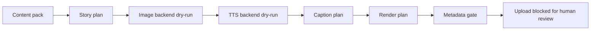

# Public Dry-Run Demo

The public demo is a safe, no-credential proof of the Reverie Studio workflow
shape. It does not call AI services, does not render media, does not read
OAuth/Firebase credentials, and does not write generated output into the
repository.

## Quick Run

```powershell
$env:PYTHONPATH="src"
python -m reverie_demo --out "$env:TEMP\reverie-public-demo"
```

Expected files:

```text
%TEMP%\reverie-public-demo\
  run_manifest.json
  stage_log.jsonl
  pipeline_report.md
```

## What It Shows



The demo proves that a fresh public clone can:

- load a public content-pack fixture
- produce a deterministic stage manifest
- write duration, cost, artifact, and status rows
- keep upload behind a manual review gate
- avoid credentials, generated media, model files, voice data, and local paths

## What It Does Not Prove

The demo does not prove that Stable Diffusion, ComfyUI, GPT-SoVITS,
Supertonic, Remotion rendering, YouTube upload, Firebase admin flows, or
machine-specific model paths are installed. Those remain local setup work.

For a real local run, use `.env.example`, `EXTERNAL_ASSETS.md`, and the
workflow docs to connect your own tools and assets.
