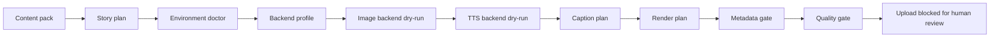

# Public Dry-Run Demo

The public demo is a safe, no-credential proof of the Reverie Studio workflow
shape. It does not call AI services, does not render media, does not read
OAuth/Firebase credentials, and does not write generated output into the
repository.

## Quick Run

```powershell
$env:PYTHONPATH="src"
python scripts\public_verify.py --out "$env:TEMP\reverie-public-verify"
Get-Content "$env:TEMP\reverie-public-verify\public_verify_report.json"
Get-Content "$env:TEMP\reverie-public-verify\public_verify_summary.md"
Get-Content "$env:TEMP\reverie-public-verify\public_demo\pipeline_report.md"
```

Expected files:

```text
%TEMP%\reverie-public-verify\
  public_verify_report.json
  public_verify_summary.md
  public_demo\
    backend_profile.json
    environment_report.json
    pack.public_demo.json
    storyboard.plan.json
    placeholder_frames.manifest.json
    placeholder_voice.manifest.json
    captions.preview.json
    render.command.preview.json
    metadata.review.json
    youtube.private_upload.not_started.json
    quality_gate.json
    video_toon_actor_template.render_plan.json
    video_toon_actor_template.asset_work_order.json
    video_toon_actor_template.remotion_props.json
    run_manifest.json
    stage_log.jsonl
    pipeline_report.md
```

For release verification, add `--with-pytest --with-functions-audit`; the
top-level report will include `publish_gate` and optional Firebase Functions
audit evidence while keeping the dry-run report-only. It also records
`workspace_state` from `git status` as counts and path fingerprints so release
review can distinguish a clean publish branch/export from local work in
progress without copying raw local path names into the report.

## What It Shows



The demo proves that a fresh public clone can:

- load a public content-pack fixture
- produce a deterministic stage manifest
- describe the selected backend profile
- check local prerequisites without reading credentials
- write a fixed-actor video-toon render plan and Remotion props dry-run
- write an asset work order listing the local variant, mouth, eye, and
  background PNG targets that a real run would need
- expose reusable face-rig fields such as `eyesClosedPath`, `mouthOpenPath`,
  `mouthClosedPath`, and `mouthCues`
- write a dry-run quality gate result
- write duration, cost, artifact, and status rows
- keep upload behind a manual review gate
- avoid credentials, generated media, model files, voice data, and local paths

## Backend Profiles

Use `--backend-profile` to choose the setup shape that the dry-run describes:

```powershell
python -m reverie_demo --backend-profile local_dry_run --out "$env:TEMP\reverie-public-demo"
python -m reverie_demo --backend-profile local_comfyui_sovits --out "$env:TEMP\reverie-sovits-plan"
python -m reverie_demo --backend-profile local_comfyui_supertonic --out "$env:TEMP\reverie-supertonic-plan"
```

The public demo still stays report-only. Choosing a real backend profile does
not start ComfyUI, TTS, Remotion, or upload.

## Local Smoke Bundle

The public demo proves the report-only workflow. To prove that the fixed actor
and background placeholders can pass the local render gate, use the local smoke
bundle instead:

```powershell
$env:PYTHONPATH="src"
python -m utils.videotoon_smoke local --source-repo-root . --output-dir "$env:TEMP\reverie-videotoon-smoke" --duration-seconds 10
```

This writes placeholder PNGs only under the chosen output directory, then runs
prepare, render-plan export, asset work-order export, and Remotion props export.
It does not call AI services, TTS, Remotion rendering, upload, or credentials.

To make those props usable by `remotion-poc/src/RadioDrama.tsx`, stage the smoke
assets into the Remotion public folder:

```powershell
python -m utils.videotoon_smoke stage-remotion "$env:TEMP\reverie-videotoon-smoke\smoke_manifest.json" --remotion-project remotion-poc
```

The stage command copies placeholder PNGs under
`remotion-poc/public/videotoon_smoke/...` and writes a staged props file whose
image paths match Remotion `staticFile()` expectations. It prints a command
preview for the actual Remotion render step, but does not run Remotion itself.

## What It Does Not Prove

The demo does not prove that Stable Diffusion, ComfyUI, GPT-SoVITS,
Supertonic, Remotion rendering, YouTube upload, Firebase admin flows, or
machine-specific model paths are installed. Those remain local setup work.

For a real local run, use `.env.example`, `EXTERNAL_ASSETS.md`, and the
workflow docs to connect your own tools and assets.
