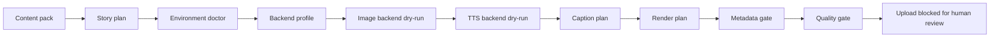

# Public Dry-Run Demo

The public demo is a safe, no-credential proof of the Reverie Studio workflow
shape. It does not call AI services, does not render media, does not read
OAuth/Firebase credentials, and does not write generated output into the
repository.

## Quick Run

```powershell
$env:PYTHONPATH="src"
python -m reverie_doctor --json
python -m reverie_demo --out "$env:TEMP\reverie-public-demo"
```

Expected files:

```text
%TEMP%\reverie-public-demo\
  backend_profile.json
  environment_report.json
  pack.public_demo.json
  storyboard.plan.json
  placeholder_frames.manifest.json
  placeholder_voice.manifest.json
  captions.preview.json
  render.command.preview.json
  metadata.review.json
  youtube.private_upload.not_started.json
  quality_gate.json
  video_toon_actor_template.render_plan.json
  video_toon_actor_template.remotion_props.json
  run_manifest.json
  stage_log.jsonl
  pipeline_report.md
```

## What It Shows



The demo proves that a fresh public clone can:

- load a public content-pack fixture
- produce a deterministic stage manifest
- describe the selected backend profile
- check local prerequisites without reading credentials
- write a fixed-actor video-toon render plan and Remotion props dry-run
- expose reusable face-rig fields such as `eyesClosedPath`, `mouthOpenPath`,
  `mouthClosedPath`, and `mouthCues`
- write a dry-run quality gate result
- write duration, cost, artifact, and status rows
- keep upload behind a manual review gate
- avoid credentials, generated media, model files, voice data, and local paths

## Backend Profiles

Use `--backend-profile` to choose the setup shape that the dry-run describes:

```powershell
python -m reverie_demo --backend-profile local_dry_run --out "$env:TEMP\reverie-public-demo"
python -m reverie_demo --backend-profile local_comfyui_sovits --out "$env:TEMP\reverie-sovits-plan"
python -m reverie_demo --backend-profile local_comfyui_supertonic --out "$env:TEMP\reverie-supertonic-plan"
```

The public demo still stays report-only. Choosing a real backend profile does
not start ComfyUI, TTS, Remotion, or upload.

## What It Does Not Prove

The demo does not prove that Stable Diffusion, ComfyUI, GPT-SoVITS,
Supertonic, Remotion rendering, YouTube upload, Firebase admin flows, or
machine-specific model paths are installed. Those remain local setup work.

For a real local run, use `.env.example`, `EXTERNAL_ASSETS.md`, and the
workflow docs to connect your own tools and assets.
